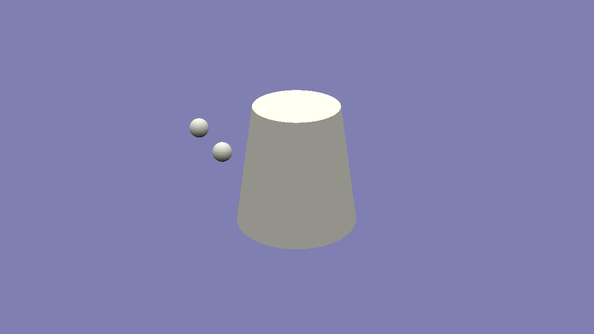

# Glitchfinite

Author: Siddharth Sahay (ssahay2)

Design: Train your note-recognition with a real live (terrible, glitchy sounding) software synth. Listen to the bass notes being played and use the keyboard to play the corresponding notes before the next bass note starts. The original idea had chords that influenced gameplay, I only had time to implement the (fully playable) synth and very rudimentary interaction with no scores or endgame.

Screen Shot:

How To Play: use the keyboard to play the synth
* a: C
* w: C#/Db
* s: D
* e: D#/Eb
* d: E
* f: F
* t: F#/Gb
* g: G
* y: G#/Ab
* h: A
* u: A#/Bb
* j: B

The synth is monophonic, but is running two voices for the player. Listen to the bass notes and play the same note on your synth before that measure ends. This is rather difficult because the reference note is bass. If you play the right note, the background will remain blue, otherwise the background will change to reddish and the poorly-modeled robot in the center will go into free-fall, which is bad even though there is no end game. The crackling noises are deliberate, they were supposed to represent lightning but that was discarded. You may need to increase your volume a bit because I didn't have time to implement a proper leveller, so the output is very quiet.

Sources: none

This game was built with [NEST](NEST.md).

